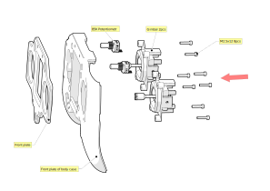
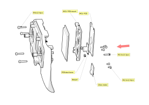
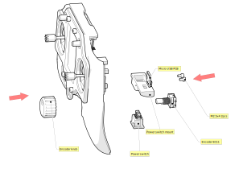
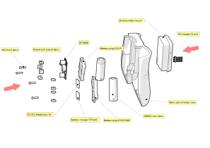

# Assembly guide

Install potentiometers first, then sticks

Install the screen and MCU board. Then install the beeper and vibration motor

Install ecoder and USB pcb

Install batteries in the back of the case. Install the power and charging boards on the battery plug.

Install the switches. Connect the two parts

